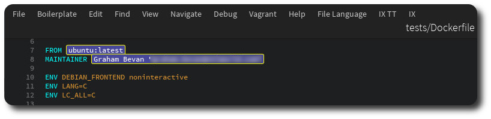
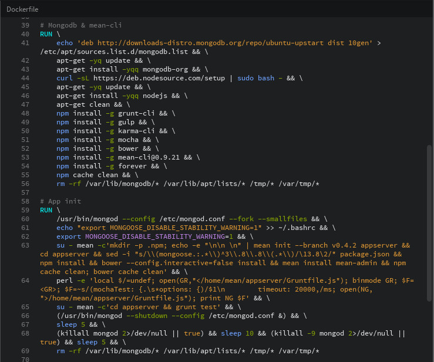
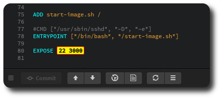

Dockerfile Syntax Highlighter
=============================

Brackets syntax highlighter for Dockerfiles.

Includes highlighting of nested shell scripts on the RUN and CMD directives.

Uses [Jacob](https://github.com/Canna71/Jacob) Lexical Tokenizer under the hood.

Screenshots
-----------

Highlighting FROM and MAINTAINER:

Syntax highlighting embedded Shell (applies to RUN and CMD directives):

Highlighting EXPOSEd ports:

enjoy!

Developing
----------

If you want to further develop this extension, feel free to fork it
on GitHub.

You will need the jacob Lexical Tokenizer installed:

    $ npm install jacob

To generate the lexer, run:

    $ node node_modules/.bin/jacob -t Dockerfile.jacoblex -l dockerlex.js

or just run:

    $ ./build.sh

which generates the lexer and zip's up the extension for release.

Also, there is a blog on how this extension was written at [reapingzombies4funandprofit](http://www.reapingzombies4funandprofit.com/blog/archives/129).
